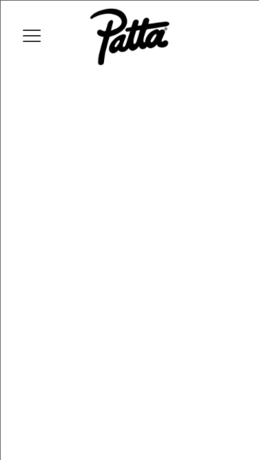
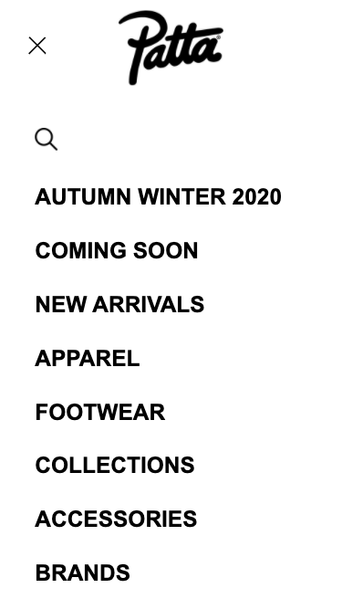
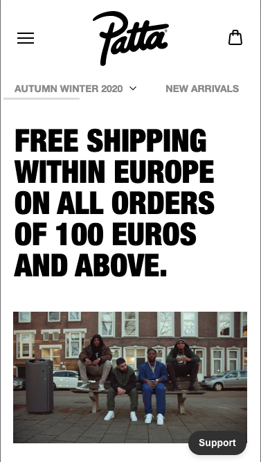
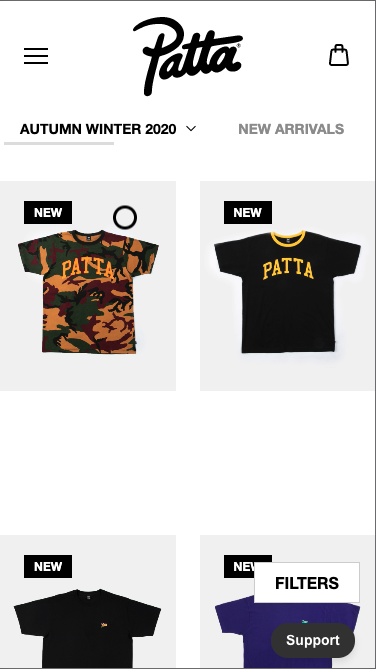

# Procesverslag
**Auteur:** -Luca Geisterfer-

Markdown cheat cheet: [Hulp bij het schrijven van Markdown](https://github.com/adam-p/markdown-here/wiki/Markdown-Cheatsheet). Nb. de standaardstructuur en de spartaanse opmaak zijn helemaal prima. Het gaat om de inhoud van je procesverslag. Besteedt de tijd voor pracht en praal aan je website.

## Bronnenlijst
1. -bron 1-
2. -bron 2-
3. -...-

## Eindgesprek (week 7/8)

-dit ging goed & dit was lastig-

**Screenshot(s):**

-screenshot(s) van je eindresultaat-

## Voortgang 3 (week 6)

-same as voortgang 1-

## Voortgang 2 (week 5)

### Stand van zaken

-Ik ben verder gegaan met mijn hamburgermenu en alle kleine dingen aangepast zodat het er hetzelfde uitziet als op de pagina van 'Patta'. Ook heb ik een tweede pagina gemaakt en die gelinkt via mijn menu. Ik liep vast bij het maken van de zoekbalk. Deze week wil ik de tekst en afbeeldingen invoegen op mijn homepage..-

**Screenshot(s):**

### Agenda voor meeting

-samen met je groepje opstellen-

Luca: De zoekbalk is nog lastig, en luca wilt zich meer in flexbox verdiepen. 
Jenny: Hamburgermenu werk niet goed, de position werkt niet nog optimaal.
Daniel: Hulp met hamburgermenu of nav, zodat dit goed staat, het gele hartje lukte bij mij niet.

## Voortgang 1 (week 3)

### Stand van zaken

-Ik ben aardig ver gekomen en heb het moeilijkste in mijn ogen al gehad. Mijn hamburger menu werkt en is geannimeerd.-

**Screenshot(s):**

Op het eerste scherm is alles nog ingeklapt, terwijl op het tweede scherm het menu open staat.

### Agenda voor meeting

-samen met je groepje opstellen-

Luca: - Hoe krijg ik een icoon rechtsboven in beeld / Hoe krijg ik een animatie van tekst over mijn afbeeldingen tijdens het scrollen / Hoe krijg ik een zoekbalk /
Jenny: - Hoe moet je een slider maken?/ Hoe moet ik de blauwe lijnen die je tussendoor ziet? / Position werkt nog niet, wat doe ik fout?/
Iconen in nav -> hoe moet ik deze vormgeven en laten werken?
Daniel: - Hoe maak je een slider met meerdere afbeelding / Hoe krijg ik mn hamburgermenu op de juiste plaats / zoekbalk lukte niet

### Verslag van meeting

-Zijn goed op weg, moet doorgaan waar ik gebleven ben en vooral veel oefenen met flexbox-

## Breakdownschets (week 1)

-uitwerken voor de 1e werkgroep - eind van de eerste week-

## Intake (week 1)
-uitwerken voor de kick-off werkgroep - begin van de eerste week-

**Je startniveau:** -rood (in de vakantie was dit blauw)-

**Je focus:** -surface plane-

**Je opdracht:** - Ik heb gekozen voor de website van Patta na te maken, https://www.patta.nl/ -

**Screenshot(s) van de eerste pagina (small screen):**

**Screenshot(s) van de tweede pagina (small screen):**

